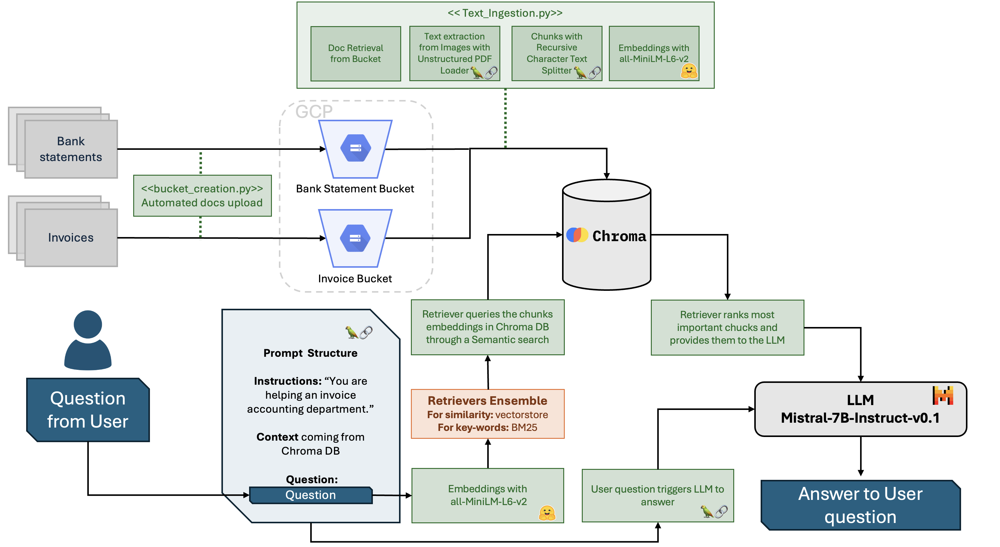

## Overview
This repository contains the codebase for a Retrieval Augmented Generation (RAG) application, designed to streamline invoice processing and payment tracking for a small to medium-sized enterprise. The system leverages Large Language Models (LLMs) to enhance the capabilities of accounting departments, allowing for quicker information retrieval and query handling.

## Project Architecture
The `Figure below` illustrates the system architecture: 
- Automated document uploads to Google Cloud Platform (GCP)
- Text extraction from various document formats using Pytesseract
- Data storage and vector embedding in a PostgreSQL database on GCP
- Utilization of Vertex AI for embedding creation (refer to `former_architecture` for an alternative approach not pursued due to capacity constraints)
- Retrieval and processing of relevant document segments through Chroma DB
- Query response generation with the Mistral-7B-Instruct-v0.1 LLM

## Business Problem Context
Invoice and payment tracking, while essential, can be labour-intensive and time-consuming. The project's RAG application aims to reduce the manual workload involved in these processes, as detailed in the report's` Business Problem Context` section.

## Dataset
The dataset comprises transactional details extracted from the enterprise's ERP system, encompassing invoice and bank statement data in Italian, German, and French. An anonymization process was applied to ensure data integrity and privacy.

## Document Ingestion and Data Flow
Documents are uploaded and stored in GCP buckets, with text extraction performed via the `<<bucket_creation.py>>` script. This process is pivotal for converting scanned documents into machine-readable formats for further processing.

## Recursive Splitter and Chroma DB
The `Recursive Splitter` function divides text data into manageable chunks, improving the precision of information retrieval. These chunks are then transformed into embeddings and stored in the Chroma DB, necessary for data retrieval.

## Ensemble Retriever and LLM Interaction
The system employs an ensemble retriever combining semantic and keyword search to ensure comprehensive document retrieval. The LLM (Mistral-7B-Instruct-v0.1) synthesizes the processed data into coherent responses to user queries. For more details in: `rag_for_invoices.ipynb` notebook.

## Model Assessment
A series of queries were executed to assess the model's performance, highlighting its strengths in general query handling and specific data retrieval. However, challenges in correlating bank statements with invoice payments were noted, indicating areas for improvement.

## Future Steps
- Refinement of semantic search algorithms and data processing techniques
- Testing alternative LLMs and embeddings
- Development of a parser for structuring tabular data from invoices

## Limitations
The model's performance is contingent on the quality of data extraction. In a deployed setting, cleaner and more structured data inputs are expected, which would likely alleviate the current extraction issues.

## Repository Structure
- `.vscode`: VSCode settings and configurations
- `archive_resources`: Archived resources and documents
- `chroma_db`: Scripts and utilities for Chroma DB interactions
- `data/invoice_scan`: Data related to invoice scanning
- `former_architecture`: Contains files for a previously attempted architecture, based only on GCP solutions
- `requirements.txt`: List of dependencies for the project

## License
This project is released under the MIT License - see the `LICENSE` file for details.

